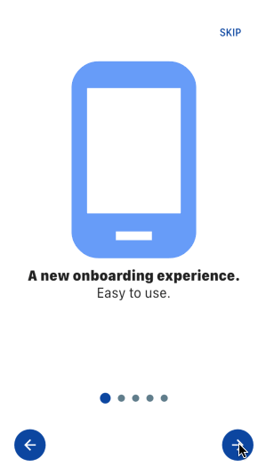

# easy_onboarding

A fully customized easy onboarding screen.

This widget can be used as an onboarding screen, a simple walkthrough of how to use you app

<b>Usage : </b>

    EasyOnboarding(
      onStart: () {
        print("getting started ");
      },
      skipButtonColor: Colors.transparent,
      backButtonColor: Colors.blue[900],
      nextButtonColor: Colors.blue[900],
      backgroundColor: Colors.white,
      indicatorSelectedColor: Colors.blue[900],
      indicatorUnselectedColor: Colors.blueGrey,
      startButtonColor: Colors.blue[900],
      nextButtonIcon: Icon(
        Icons.arrow_forward,
        color: Colors.white,
      ),
      skipButtonText: Text(
        'SKIP',
        style: TextStyle(fontSize: 15.0, color: Colors.blue[900]),
      ),
      startButtonText: Text(
        'GETTING STARTED',
        style: TextStyle(
          color: Colors.white,
          fontSize: 15.0,
        ),
      ),
      backButtonIcon: Icon(
        Icons.arrow_back,
        color: Colors.white,
      ),
      children: [
        Container(
          child: Column(
            children: [
              Container(
                child: Icon(
                  Icons.phone_android,
                  size: 300,
                  color: Color(0xFF679CF8),
                ),
              ),
              Text(
                'A new onboarding experience.',
                style: TextStyle(
                  fontSize: 20.0,
                  fontWeight: FontWeight.w900,
                ),
              ),
              Text(
                "Easy to use.",
                style: TextStyle(
                  fontSize: 20.0,
                ),
              )
            ],
          ),
        ),
        Container(
          child: Column(
            children: [
              Container(
                child: Icon(
                  Icons.thumb_up,
                  size: 300,
                  color: Color(0xFF679CF8),
                ),
              ),
              Text(
                'Try it.',
                style: TextStyle(
                  fontSize: 20.0,
                  fontWeight: FontWeight.w900,
                ),
              ),
              Text(
                "Easy to customize.",
                style: TextStyle(
                  fontSize: 20.0,
                ),
              )
            ],
          ),
        ),
        Container(
          child: Column(
            children: [
              Container(
                child: Icon(
                  Icons.color_lens,
                  size: 300,
                  color: Color(0xFF679CF8),
                ),
              ),
              Text(
                'Fully customizable',
                style: TextStyle(
                  fontSize: 20.0,
                  fontWeight: FontWeight.w900,
                ),
              ),
              Text(
                "Change colors",
                style: TextStyle(
                  fontSize: 20.0,
                ),
              )
            ],
          ),
        ),
        Container(
          child: Column(
            children: [
              Container(
                child: Icon(
                  Icons.widgets,
                  size: 300,
                  color: Color(0xFF679CF8),
                ),
              ),
              Text(
                'Add your own widgets',
                style: TextStyle(
                  fontSize: 20.0,
                  fontWeight: FontWeight.w900,
                ),
              ),
              Text(
                "No restriction",
                style: TextStyle(
                  fontSize: 20.0,
                ),
              )
            ],
          ),
        ),
        Container(
          child: Column(
            children: [
              Container(
                child: Icon(
                  Icons.cloud_download,
                  size: 300,
                  color: Color(0xFF679CF8),
                ),
              ),
              Text(
                'Install easy_onboarding',
                style: TextStyle(
                  fontSize: 20.0,
                  fontWeight: FontWeight.w900,
                ),
              ),
              Text(
                "Created by Dicksen",
                style: TextStyle(
                  fontSize: 20.0,
                ),
              )
            ],
          ),
        ),
      ],
    );
